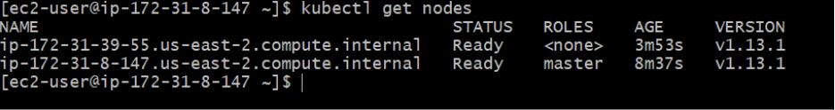

# k8 yaml manifest files

#steps to install minikube on windows

- Install chololotay package manager for windows.

Set-ExecutionPolicy Bypass -Scope Process -Force; iex ((New-Object System.Net.WebClient).DownloadString('https://chocolatey.org/install.ps1'))

- Install minkube by running below command on powershell

choco install minikube kubernetes-cli

# steps to install minkube on linux
curl -Lo minikube https://storage.googleapis.com/minikube/releases/latest/minikube-linux-amd64 \
  && chmod +x minikube
  

# steps to install docker ce or ee

yum-config-manager \
--add-repo \
"$DOCKERURL/rhel/docker-ee.repo"

Enable the preferred version from Docker Repository 

/etc/yum.repos.d/docker-ee.repo
[docker-ee-stable-18.09]
name=Docker EE Stable 18.09 - $basearch
baseurl=$dockerurl/$dockerosversion/$basearch/stable-18.09/
enabled=1
gpgcheck=1
gpgkey=$dockerurl/gpg

Install docker using below command : 

yum -y install docker-ee

Enable and start docker service

systemctl enable docker

systemctl start  docker

systemctl status docker

# Steps to install docker and minikube and kubernetes.

Steps for Kubernetes Cluster with Internet access

Step1: Take Two Linux Machines , one will be used to Master and second as Worker Node.

Step2 : There are some prerequisites we will follow before installing the kubernetes cluster.

The swap partition should be disabled from /etc/fstab
Check the SELINUX should be disabled mode.
Turn off selinux.

sudo setenforce 0
sudo vi /etc/selinux/config
Change the line that says SELINUX=enforcing to SELINUX=permissive and save the file.

Step3: Install and run docker on both Master and Worker node

Install and configure Docker.

sudo yum -y install docker
sudo systemctl enable docker
sudo systemctl start docker

Step3: create a kubernetes repo on both master and worker node machines.

Add the Kubernetes repo.

cat << EOF | sudo tee /etc/yum.repos.d/kubernetes.repo
[kubernetes]
name=Kubernetes
baseurl=https://packages.cloud.google.com/yum/repos/kubernetes-el7-x86_64
enabled=1
gpgcheck=1
repo_gpgcheck=1
gpgkey=https://packages.cloud.google.com/yum/doc/yum-key.gpg https://packages.cloud.google.com/yum/doc/rpm-package-key.gpg
EOF

Step4: Install Kubernetes Components on master as well as worker node.

sudo yum install -y kubelet kubeadm kubectl
sudo systemctl enable kubelet
sudo systemctl start kubelet

Step 5 :  Configure sysctl on both kubernetes nodes.

cat << EOF | sudo tee /etc/sysctl.d/k8s.conf
net.bridge.bridge-nf-call-ip6tables = 1
net.bridge.bridge-nf-call-iptables = 1
EOF

sudo sysctl --system

Step6: Initialize the Kube Master. Do this only on the master node.

sudo kubeadm init --pod-network-cidr=10.244.0.0/16
mkdir -p $HOME/.kube
sudo cp -i /etc/kubernetes/admin.conf $HOME/.kube/config
sudo chown $(id -u):$(id -g) $HOME/.kube/config

Step7: Run join command on worker node

sudo kubeadm join 100.31.8.000:6443 --token 8nolmf.lgx1dzu93ptd1327 --discovery-token-ca-cert-hash sha256:dfa29e9ef942670e4cf97420f5d07300f3af1ddee7f5650698ace79f55f60917

Step8: Install flannel or weavenet networking as per the requirement for pod networking.

kubectl apply -f https://raw.githubusercontent.com/coreos/flannel/bc79dd1505b0c8681ece4de4c0d86c5cd2643275/Documentation/kube-flannel.yml

Step9: Both Kubernetes node should be in READY status now

